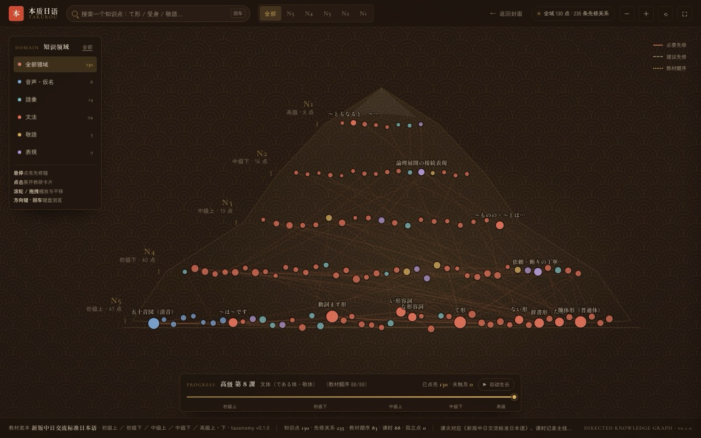

# 本质日语 Takurou · 标准日本语知识图谱

> 言葉の本質は、交流にある。
> 把《新版中日交流标准日本语》里的知识点拆成原子节点，用「先修 → 解锁」的依赖关系重新织成一张图。

富士山轮廓的知识图谱：山脚 N5、山顶 N1，学习进度就是登山高度。

## 在线预览

**https://neleyang.github.io/standard_japanese_kg/**

---

## 两页结构

站点只有两页，从封面点进去才是图谱 —— 不是页签切换。

| 页面 | 文件 | 职责 |
|---|---|---|
| 封面页 | `index.html` | 一屏入口。富士山主视觉 + 花吹雪动效 + 五段坂（按等级进入）+ 规模数据 |
| 知识图谱页 | `takurou-graph.html` | 全量交互。缩放、平移、搜索、领域筛选、等级筛选、学习进度滑杆、详情面板 |

**封面页**（浅色 · 生成り和纸底）


**知识图谱页**（深色 · 焦茶底 + 青海波暗纹）



封面页任意入口 → `takurou-graph.html#<节点id>` 深链落地，自动选中该知识点并展开详情面板。

---

## 数据模型

全部数据集中在 `data/takurou-taxonomy.js`，导出一个 `window.TAKUROU_KG`，**两页读同一份**。

```
130 知识点 · 235 条先修关系（127 硬性 / 108 建议）· 83 条教材顺序边
88 课时 · 5 个知识领域 · 5 个等级 · 0 个孤立点 · 平均关联 3.62
```

**节点字段**

| 字段 | 含义 |
|---|---|
| `id` | 稳定标识，用于深链 |
| `jp` / `cn` | 日文表述 / 中文释义 |
| `k` | 领域：`on` `goi` `bun` `keigo` `hyou` |
| `l` | 等级：0=N5 到 4=N1 |
| `ls` | 所属课时 |
| `des` / `ex` | 说明 / 例句 |
| `pit` / `ev` | 易错点 / 掌握证据 |
| `pre` / `unlock` | 直接先修 / 可解锁 |
| `rel` | 关联总数（运行时算出，不手写） |

**等级分布**

| 等级 | 教材 | 课次 | 知识点 | 课时 |
|---|---|---|---|---|
| N5 入門 | 初级上 | 第1課–第24課 | 47 | 24 |
| N4 基礎 | 初级下 | 第25課–第48課 | 40 | 24 |
| N3 応用 | 中级上 | 第1課–第16課 | 19 | 16 |
| N2 展開 | 中级下 | 第1課–第16課 | 16 | 16 |
| N1 語感 | 高级 | 上・下 | 8 | 8 |

**知识领域**

| 领域 | 中文 | 暗底色 | 知识点 |
|---|---|---|---|
| 音声・仮名 | 音声与假名 | `#7FA8D8` | 8 |
| 語彙 | 词汇 | `#7FC0C4` | 14 |
| 文法 | 语法 | `#E4735C` | 94 |
| 敬語 | 敬语 | `#D9B25F` | 5 |
| 表現 | 表达与功能 | `#B49BD8` | 9 |

**数据自校验**：数据层在构建时会丢弃端点不存在的非法边并计入 `dropped`，同时统计孤立节点。图谱页检测到 `isolated > 0` 会直接亮出拦截提示，不会静默放过。

---

## 目录结构

```
├── index.html                 封面页
├── takurou-graph.html         知识图谱页
├── data/
│   └── takurou-taxonomy.js    共享数据层
├── assets/
│   ├── cover.jpg
│   └── graph.jpg
├── _archive/
│   └── kotonoha-homepage.html 早期版本，仅留档
├── .impeccable.md             设计上下文（配色、字体、禁忌）
└── .nojekyll                  关闭 GitHub Pages 的 Jekyll 处理
```

---

## 本地运行

数据层是用 `<script src>` 加载的，直接双击 `index.html` 走 `file://` 协议即可，无需构建。

起本地服务（可选，便于调试相对路径）：

```bash
python3 -m http.server 8781
# 打开 http://127.0.0.1:8781/index.html
```

零依赖、零构建步骤，改完刷新即可生效。

---

## 交互与无障碍

- **键盘可达**：节点 `tabindex="0"`，`Enter` / `Space` 激活；搜索框支持 `↑` `↓` 选择、`Enter` 确认
- **进度滑杆**：按教材顺序推进，实时点亮已学节点并统计「已点亮 / 未触及」
- **缩放复位**：`+` `-` 缩放、复位键归位、全屏切换
- **降低动效**：遵循 `prefers-reduced-motion`，开启后停用花吹雪与脉冲动画
- **触控目标**：按钮与 chip 不小于 44px

---

## 设计与技术约定

**和色体系**（封面页浅色 / 图谱页深色两套，深色底需重新校准饱和度）

| 角色 | 浅色底 | 深色底 |
|---|---|---|
| 背景 | 生成り `#FAF6EC` | 焦茶 `#241811` |
| 主色 | 藍 `#1F3A5C` | 縹 `#7FA8D8` |
| 强调 | 朱 `#B83A2C` | 朱 `#E4735C` |
| 装饰 | 金茶 `#A8874A` | 金茶 `#D9B25F` |

**字体**：标题 Shippori Mincho B1（明朝体）· 正文 Zen Kaku Gothic New · 拉丁与数字 Cormorant Garamond

**两条硬性约定**

1. **界面上的任何数字都不得手写**。包括正文、图注、chip 计数、`aria-label` 里的关联数，一律从数据层实时算出后回填，避免文案与图不一致。
2. **图谱是 SVG 绘制，不是 canvas**。节点用绝对坐标布局（按教材顺序排层 + 一维等距松弛防重叠），缩放与平移作用在整个 `world` 分组上。SVG 自带 `preserveAspectRatio` 与代码里的像素坐标换算必须统一走同一个 `metrics()`，否则会出现双重缩放导致节点错位。

---

## 数据校对说明

课时主线取的是**该课语法核心**，不是课文标题原文。中上・中下为逐课完整，高级为语感・文体主线精选。

节点与先修关系仍需**对照教材目录复核**后才能作为教学依据使用。

---

## 授权

内容基于《新版中日交流标准日本语》整理，教材版权归原出版方所有。本仓库仅作知识结构整理与可视化演示。
